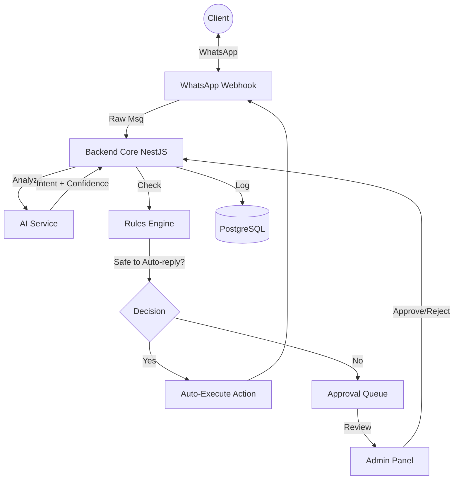

# AI Employee - System Architecture & Design Document

## 1. System Overview (The High-Level Mental Model)
The system operates as a "Human-in-the-Loop" AI Agent. It is not an autonomous chatbot but a managed employee that suggests actions for approval.

### The "3-Brain" Concept
1.  **The Messenger (WhatsApp/Input)**: Dumb terminal. Only receives and sends text.
2.  **The Brain (Backend + AI)**: Processes input, understands intent (`ai`), checks rules (`workflows`), and decides on a response.
3.  **The Judge (Admin/Human)**: Reviews risky actions via the Admin Panel before they are executed.

---

## 2. Backend Architecture (NestJS)
The backend is the decision-maker. It is structured largely into **functional modules**.

### Directory Structure (`src/`)
| Module | Responsibility |
| :--- | :--- |
| **`whatsapp/`** | Handles Cloud API webhooks (verification, receiving event). Sends outgoing messages. |
| **`conversations/`** | Manages chat history. Ensures the AI knows the *context* of the chat. |
| **`ai/`** | Wraps the LLM (OpenAI/Anthropic). Handles prompt engineering and JSON parsing of intents. |
| **`intents/`** | Defines possible user goals (e.g., `schedule_meeting`, `get_pricing`, `complaint`). |
| **`workflows/`** | The "Rules Engine". Maps `Intent -> Workflow`. (e.g. `If Intent = 'complaint', notify manager`). |
| **`approvals/`** | Manages the queue of actions waiting for human verification. |
| **`actions/`** | logic for executing tasks (e.g., `send_message`, `create_ticket`, `update_crm`). |
| **`logs/`** | High-fidelity audit logs. Every AI decision is recorded here for debugging/compliance. |

---

## 3. Database Design (PostgreSQL)
The database is the "Source of Truth".

### Core Entities (ERD)

#### 1. `businesses`
Multi-tenancy support.
- `id` (PK)
- `name`
- `config_json` (e.g., timezone, working hours)

#### 2. `conversations`
Represents a unique chat thread with a customer.
- `id` (PK)
- `business_id` (FK)
- `whatsapp_number` (Unique per business)
- `context_summary` (AI-generated summary of recent chat)
- `last_message_at`

#### 3. `messages`
The raw chat logs.
- `id` (PK)
- `conversation_id` (FK)
- `role` (`user`, `assistant`, `system`)
- `content` (Text body)
- `metadata` (JSON - e.g., message status read/delivered)

#### 4. `intents` (AI Logs)
Stores what the AI *thought* the user meant.
- `id` (PK)
- `message_id` (FK)
- `intent_name` (e.g., `schedule_visit`)
- `confidence_score` (0.0 - 1.0)
- `extracted_entities` (JSON - e.g., `{ "date": "tomorrow" }`)

#### 5. `workflow_rules`
Defines the "SOP" (Standard Operating Procedure).
- `id` (PK)
- `intent_name`
- `min_confidence` (Threshold for auto-approval)
- `requires_human_approval` (Boolean)

#### 6. `approvals`
The queue for the Admin Panel.
- `id` (PK)
- `workflow_id` (FK)
- `proposed_action` (JSON preview of what will happen)
- `status` (`PENDING`, `APPROVED`, `REJECTED`)
- `reviewed_by` (User ID)

---

## 4. Frontend (Admin Panel)
**Stack**: React, Tailwind CSS, ShadcnUI (recommended for "Premium" feel).
**Goal**: Speed. The admin should approve/reject in seconds.

### Key Screens
1.  **Live Feed (Dashboard)**: Real-time list of active conversations.
2.  **Approval Queue**: A Tinder-like interface for requests.
    - *Card*: "User asked for a refund."
    - *AI Suggestion*: "Reply: 'I can process that for you...'"
    - *Buttons*: [Approve] [Reject] [Edit]
3.  **SOP Config**: Simple table to toggle `requires_human_approval` for specific intents.

---

## 5. AI Integration Strategy
**Golden Rule**: `AI Suggests, System Decides`.

1.  **Extraction**: AI is asked to extract `Intent` and `Entities`.
2.  **Scoring**: AI must provide a `confidence` score.
3.  **Gating**:
    - `Confidence < 0.7` → **Fallback** ("Can you clarify?")
    - `Confidence > 0.7` AND `Rule says 'Safe'` → **Auto-Execute**.
    - `Confidence > 0.7` AND `Rule says 'Risky'` → **Create Approval Request**.

---

## 6. Execution Roadmap

### Phase 1: Foundation (The Skeleton)
- [ ] Initialize Monorepo.
- [ ] Setup simple NestJS server + PostgreSQL connection.
- [ ] Connect WhatsApp Cloud API Webhook.
- [ ] Test: Receive a message, save to DB, auto-reply "Echo".

### Phase 2: The Brain (AI)
- [ ] Integrate OpenAI API.
- [ ] prompt Engineering: "You are a helpful assistant for [Business Name]..."
- [ ] Implement `Intent Service` to classify messages.

### Phase 3: The Control (Approvals)
- [ ] Build the `approvals` table.
- [ ] Create the React Admin Dashboard.
- [ ] Connect the "Approve" button to trigger the pending WhatsApp reply.
